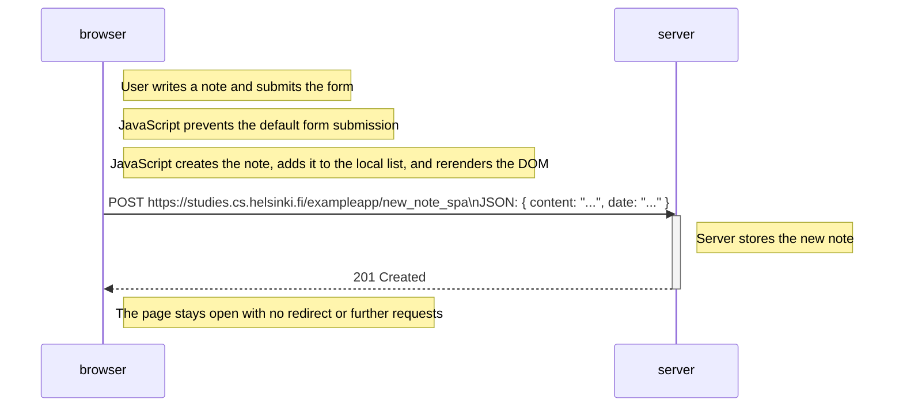

# Exercise 0.6: New note in a single-page app diagram

```mermaid
sequenceDiagram
    participant browser
    participant server

    Note right of browser: User writes a note and submits the form
    Note right of browser: JavaScript prevents the default form submission
    Note right of browser: JavaScript creates the note, adds it to the local list, and rerenders the DOM

    browser->>server: POST https://studies.cs.helsinki.fi/exampleapp/new_note_spa\nJSON: { content: "...", date: "..." }
    activate server
    Note right of server: Server stores the new note
    server-->>browser: 201 Created
    deactivate server

    Note right of browser: The page stays open with no redirect or further requests
```
